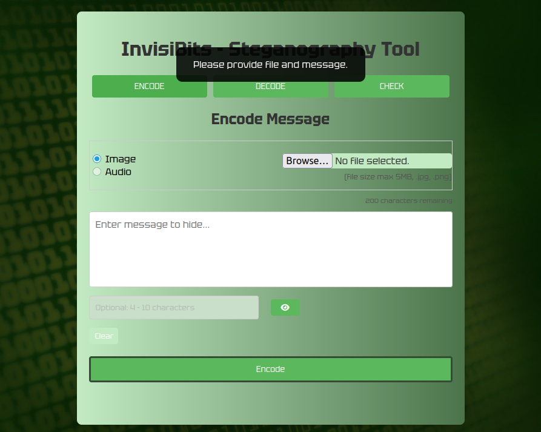
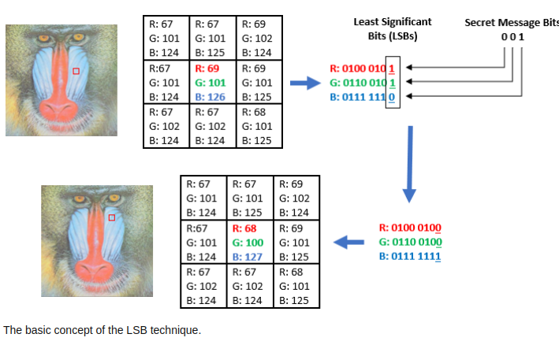

# Cybersecurity Module - InvisiBits

## Overview
**InvisiBits** is a web-based steganography tool that enables users to securely hide and extract messages within images using the Least Significant Bit (LSB) technique. The tool is designed for both ease of use and robust security, making it suitable for cybersecurity professionals, digital forensics experts, and anyone interested in secure communication.

---

## **How It Works**

1. **Encoding a Message**
   - **Upload**: Select an image file (PNG or JPG) to use as the carrier.
   - **Message Input**: Type the secret message you want to hide.
   - **Optional Password**: Enter a password if you want to encrypt the message for extra security. All encryption and decryption is performed in your browser using JavaScript (CryptoJS); the password and unencrypted message are never sent to the server.
   - **Encode**: Click "Encode" to embed the (optionally encrypted) message into the image using the LSB technique. The backend simply embeds the message as-is and returns the modified image.
   - **Download**: The encoded image is automatically downloaded.

2. **Decoding a Message**
   - **Upload**: Select a steganographic image (PNG or JPG) that may contain a hidden message.
   - **Optional Password**: If the message was encrypted, enter the password to decrypt it.
   - **Decode**: Click "Decode" to extract the hidden message. The backend extracts the message as-is and returns it to the browser, where it is decrypted if needed.
   - **View/Save**: The decoded message is displayed in a popup and can be saved as a `.txt` file.

3. **Checking for Hidden Messages**
   - **Upload**: Select an image to check for the presence of a hidden message.
   - **Check**: The tool analyzes the image to determine if it contains a hidden message by inspecting the LSBs of the first 32 pixels.
   - **Result**: The interface displays whether a hidden message was detected.

--- 

## **Key Features and Cybersecurity aspects**
- **Client-Side Security**: All password-based encryption and decryption is performed in the browser using CryptoJS. The server never sees your password or unencrypted message.
- **User-Friendly Interface**: Clear labels, character counters, password toggle buttons, and robust error handling make the tool easy to use.
- **XSS Protection**: User inputs are sanitized using DOMPurify to prevent cross-site scripting attacks.
- **Efficient Algorithms**: Encoding and decoding operate in linear time (`O(n)`), ensuring fast performance even for large images.
- **File Validation**: Only PNG and JPG files up to 5MB are accepted, protecting against unsupported formats and resource exhaustion.
- **Unicode and Special Character Support**: The tool fully supports encoding and decoding messages containing emojis, special symbols, and non-ASCII characters (e.g., ä, ö, å, 你好, 😊). Messages are encoded and decoded using UTF-8, ensuring all Unicode characters are preserved. If you see garbled output for such characters, ensure you are using the latest version of the tool with UTF-8 support.

---

## Screenshot from the App



<video src="static/images/ste_tool.mp4" controls width="600">
  Your browser does not support the video tag.
</video>

---

## Repository Structure
```
invisibits/
├── static/
│   ├── images/
│   │   ├──  encoded/         # Encoded images
│   │   └──  normalpictures/  # Different sized pictures for testing
│   ├── messages/             # Decoded messages
│   ├── scripts/
│   │   └── main.js           # JavaScript for frontend interactions
│   └── styles/
│       ├── cyber.jpg
│       └── style.css         # CSS file for styling
├── templates/
│   └── index.html            # HTML template for the web interface
├── utils/
│   ├── decoder.py            # Decoding logic
│   └── encoder.py            # Encoding logic
├── .gitignore                # Files and directories to ignore in version control
├── app.py                    # Main Flask application
├── README.md                 # Project documentation
├── requirements.txt          # Python dependencies
└── summary_of_project.pdf    # PDF of the project
```

---

## If you need to install Python 3 and pip (Python package manager)

- **Python 3:**  
  Download and install from [python.org/downloads](https://www.python.org/downloads/).
- **pip:**  
  Usually included with Python 3.4+. If not, see [pip installation guide](https://pip.pypa.io/en/stable/installation/).

**Windows users:**  
- Use `python` instead of `python3` in commands.  
- To activate the virtual environment, use `venv\Scripts\activate` instead of `source venv/bin/activate`.


## Setup Instructions
1. Clone the repository:
   ```bash
   git clone https://gitea.koodsisu.fi/lauralevisto/invisibits.git
   ```
2. Navigate to the project directory:
   ```bash
   cd invisibits
   ```
3. Create a virtual environment and install dependencies:
   ```bash
   python3 -m venv venv
   source venv/bin/activate
   pip install -r requirements.txt
   ```
4. Start the Flask application:
   ```bash
   python app.py
   ```
5. Open your browser and go to `localhost:5000`.

6. Stop the Flask server
   ```bash
   Ctrl+C
   ```

7. Close the virtual environment:
   ```bash
   deactivate
   ```

---

## Concepts Explained

### **1 . What is Steganography?** and **Relevance to Digital Forensics**

**Steganography** is the practice of hiding secret information within an ordinary, non-secret file or message to avoid detection. Unlike encryption, which makes the content unreadable to outsiders, steganography conceals the very existence of the message. A common example is embedding a text message within the pixels of an image using the Least Significant Bit (LSB) technique, so the image looks unchanged to the human eye.

In **digital forensics**, steganography is highly relevant because:

- **Detection of Hidden Evidence:** Criminals or malicious actors may use steganography to hide illicit communications, sensitive data, or incriminating evidence within seemingly innocent files (like images, audio, or video).
- **Data Exfiltration:** Attackers can use steganography to smuggle confidential data out of an organization without triggering traditional security alerts.
- **Forensic Analysis:** Forensic experts must be able to detect, extract, and analyze hidden messages to uncover the full scope of digital crimes.
- **Counter-Steganography:** Understanding steganography helps forensic professionals develop tools and techniques to identify and counteract hidden data, ensuring that no evidence is overlooked during investigations.


### **2. Least Significant Bit (LSB) Technique**
- **Description**:
  - The LSB technique modifies the least significant bit of each pixel's color value to embed binary data.
  - Since the change is minimal, it is imperceptible to the human eye.
- **Example**:
  - Original pixel value: `(10101010, 11001100, 11110000)`
  - Modified pixel value: `(10101011, 11001101, 11110001)` (binary data embedded in the LSBs).


**Picture before and after**


**LSB**




### **3. Difference Between Steganography and Encryption**
- **Steganography**:
  - Hides the existence of a message by embedding it within a carrier (e.g., an image).
  - The goal is secrecy—an observer should not know a message exists.
- **Encryption**:
  - Converts a message into an unreadable format using a key.
  - The goal is security—an observer knows a message exists but cannot read it without the key.

---

## **Why Python is Used**
- **Ease of Use**: Python's simplicity and readability make it ideal for rapid development.
- **Libraries**: Python has robust libraries like `Flask` for web development and `Pillow` for image processing.
- **Cross-Platform**: Python is platform-independent, ensuring the tool works on various operating systems.

---

## **Why Each Library is Used**
1. **Flask**:
   - Provides a lightweight framework for building the web application.
   - Handles routing, request processing, and serving static files.

2. **Pillow**:
   - Used for image processing, including reading, modifying, and saving images.
   - Essential for implementing the LSB steganography technique.

3. **CryptoJS (Frontend JavaScript)**:
   - Provides secure AES encryption and decryption for password-protected messages, performed entirely in the browser.

---

### **How the Interface is Embedded with Python**
- The `index.html` file is served by Flask using the `render_template` function.
- Static files (CSS, JavaScript, images) are served from the `static/` directory.
- User actions on the interface trigger AJAX requests to Flask routes (`/encode` and `/decode`), which process the requests and return responses.

---

## Disclaimer

This tool is intended for educational and ethical use only.  
Do not use InvisiBits for any illegal activities or to violate the privacy or rights of others.  
The author is not responsible for any misuse of this software.

---

## Coder

Laura Levistö     
5/2025